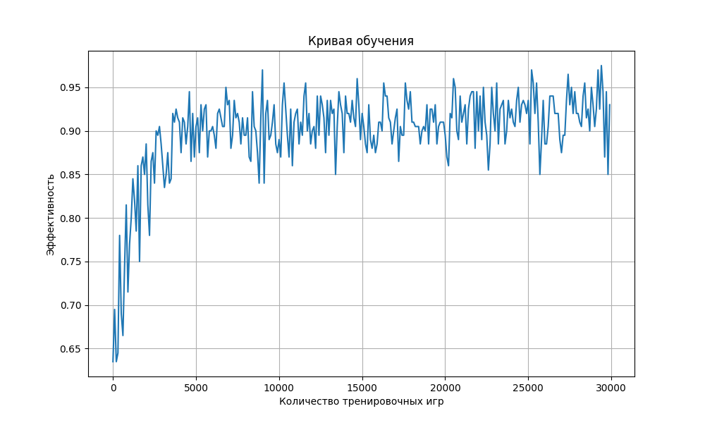

# Лабораторная 3 по курсу "Технологии искусственного интеллекта"

### Задача:
1. Обучить модель играть в игру крестики-нолики.
2. Модель должна играть на поле 3х3
3. Отобразить кривую обучения модели.

(Не выполнил)\
Дополнительное задание (баллы х2): * Модель должна уметь играть на поле произвольного размера (размер поля задается игроком, после обучения модели).

## Реализация

Результаты предоставлены в ноутбуке [solution.ipynb](solution.ipynb)

Основной класс `Game` управляет состоянием и правилами игры, включая определение победителя и
допустимых ходов. Класс `ValuePolicy` обучает агента на основе состояний, назначая значения для
оценки лучшего хода. Для проверки стратегии используются функции `play_games` и `evaluate_performance`.

## Результаты

Модель лучше адаптируется с увеличением числа итераций, особенно начиная с прогресса около
3000. В начале значение около 0.64, но после нескольких тысяч шагов эффективность стабильно растет и
колеблется около 0.9.

## Выполнил
- Каримов Аскар, гр. М8О-208М-23

