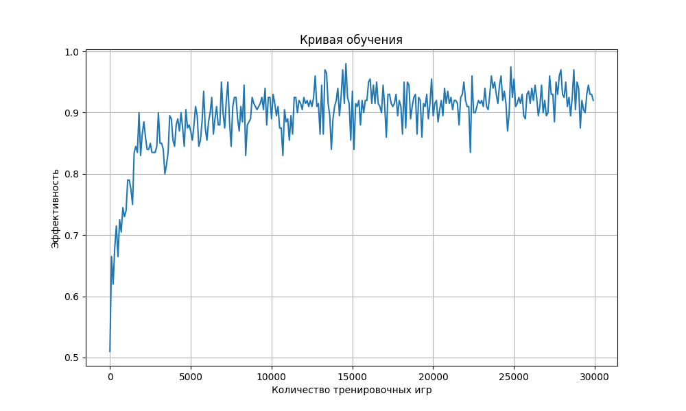

# Лабораторная 3 по курсу "Технологии искусственного интеллекта"

### Задача:
1. Обучить модель играть в игру крестики-нолики.
2. Модель должна играть на поле 3х3
3. Отобразить кривую обучения модели.

## Реализация

Реализация предоставлена в ноутбуке [solution.ipynb](solution.ipynb)

Основная логика игры реализована в классе `Game`, который отвечает за управление состоянием игрового
поля, проверку правил и определение победителя. Для обучения агента используется класс `ValuePolicy`,
где реализован алгоритм оценки состояний игрового поля

Проверка качества игры модели проводится с помощью функций `play_games` (игровой процесс) и
`evaluate_performance` (оценка эффективности стратегии).

## Результаты

Модель лучше адаптируется с увеличением числа итераций, особенно начиная с прогресса около
3000. В начале значение около 0.64, но после нескольких тысяч шагов эффективность стабильно растет и
колеблется около 0.9.

## Выполнил
- Каримов Аскар, гр. М8О-208М-23

